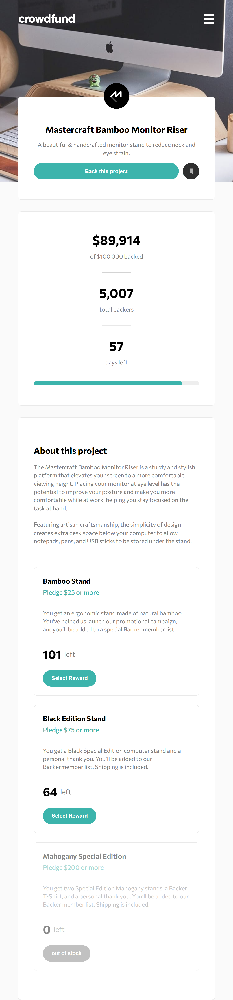

# Frontend Mentor - Crowdfunding product page solution

This is a solution to the [Crowdfunding product page challenge on Frontend Mentor](https://www.frontendmentor.io/challenges/crowdfunding-product-page-7uvcZe7ZR). Frontend Mentor challenges help you improve your coding skills by building realistic projects. 

## Table of contents

- [Overview](#overview)
  - [The challenge](#the-challenge)
  - [Screenshot](#screenshot)
  - [Links](#links)
- [My process](#my-process)
  - [Built with](#built-with)
  - [What I learned](#what-i-learned)
  - [Continued development](#continued-development)
  - [Useful resources](#useful-resources)
- [Author](#author)
- [Acknowledgments](#acknowledgments)

**Note: Delete this note and update the table of contents based on what sections you keep.**

## Overview

### The challenge

Users should be able to:

- View the optimal layout depending on their device's screen size
- See hover states for interactive elements
- Make a selection of which pledge to make
- See an updated progress bar and total money raised based on their pledge total after confirming a pledge
- See the number of total backers increment by one after confirming a pledge
- Toggle whether or not the product is bookmarked

### Screenshot

### Links

- [Solution URL](https://github.com/mostafa-meerzad/crowd-funding-page)
- [Live Site URL](https://unique-basbousa-aa6895.netlify.app/)

## My process

### Built with

- Semantic HTML5 markup
- Flexbox
- CSS Grid
- Mobile-first workflow
- Scss preprocessor
- [React](https://reactjs.org/) - JS library

### What I learned
How to use react-accessible-accordion library, customizing progress-bar to appear the same on different browsers

### Continued development
I want to learn backend development and make this web-site fully functional.

But untill that point I think it's OK :)

### Useful resources

- [react js accordion](https://www.npmjs.com/package/react-accessible-accordion) - This helped me for making products section to extend and collapse.

## Author

- Frontend Mentor - [mostafa-meerzad](https://www.frontendmentor.io/profile/mostafa-meerzad)
- GitHub - [mostafa-meerzad](https://github.com/mostafa-meerzad/crowd-funding-page)

